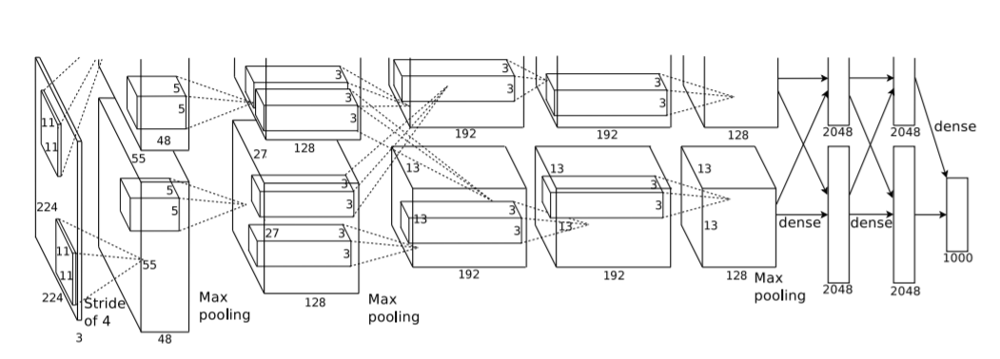
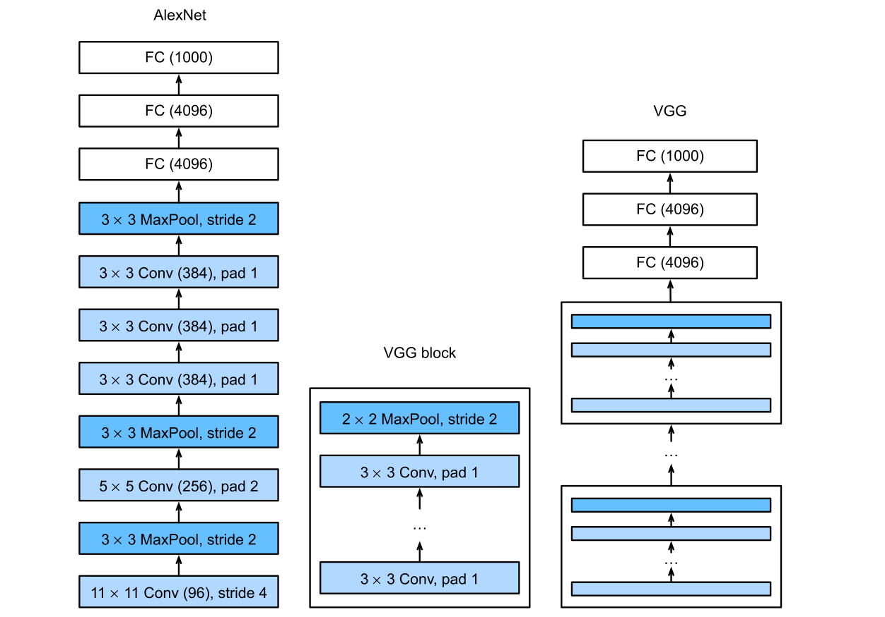
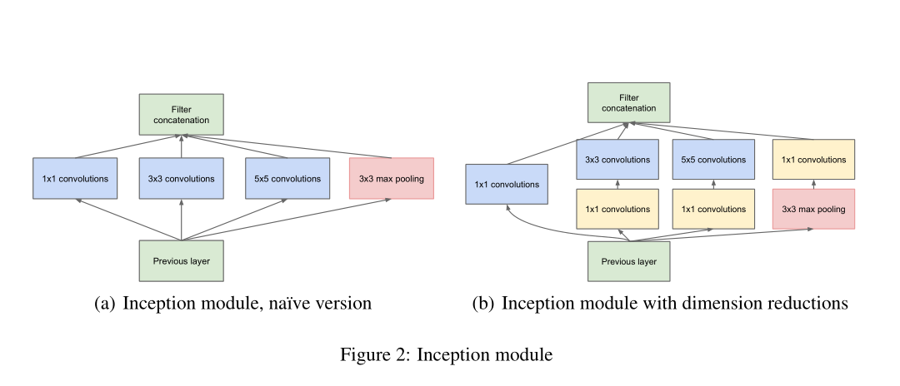
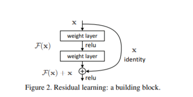

## implementation of AlexNet, VGG, GoogleNet, ResNet

---
**AlexNet**

AlexNet比LeNet更深更大得到更好的精度。

在AlexNet出现之前，对于图像的处理更多是关注在特征提取。它的出现，⾸次证明了学习到的特征可以超越⼿⼯设计的特征。

---

能不能更深？

+ 更多全连接层（太贵）
+ 更多卷积层
+ 将卷积层组合成块

---

**VGG**（very  deep convolutional networks for large scale image recongition)

感觉是受到alexnet最后三个卷积层和最大池化层启发

propose idea:

VGG块，作为基础架构。m个$3 \times 3$ Conv, `padding = 1` ；最后接一个 $2 \times 2$ 的最大池化层，`stride=2`。

相比AlexNet优点：

+ depth
+ 精度相比于AlexNet提升很多

缺点：

+ 占内存
+ 速度比AlexNet慢

总结：

+ VGG使用可重复使用的卷积块来构建深度卷积神经网络（idea1: 重复使用）
+ 不同的卷积块个数和超参数可以得到不同的复杂度（idea2: 不同的配置）

---

**GoogleNet**

网络中的网络（NiN)

$1\times 1$ Conv，不识别空间模式，只融合通道。可以看作全连接层。

使用很少，但思想可以借鉴

总结：

+ NiN块使用卷积层加上两个$1\times 1$卷积层， 后者对每个像素增加了非线性性
+ NiN使用全局平均池化层来代替VGG与AlexNet的全连接层。 不容易过拟合，更少的参数个数

**googlenet是含并行连结的网络。**

motivation:

+ 很多神经网络是通过增加他们的大小来提升性能的，然而网络越大，随之而来的就是参数越来越多，难以训练。考虑既满足大小且参数不那么多，同时也能通过增加深度的网络

主要idea:

+ inception块，4个路径从不同层抽取信息，然后在输出通道合并。只改变通道数，不改变高宽

+ inception块用四条不同超参数的卷积层和池化层的路来抽取不同信息。它的一个主要优点是模型参数小，计算复杂度降低。
+ GoogleNet使用了9个inception块，是第一个到上百层的网络

解决问题：

+ 精度相比于VGG网络精度进一步提升

改进与不足：

+ inceptionV3，V4, 后续有残差网络等一系列改进
+ 占内存和速度VGG差不多
+ 构造奇怪

---

**ResNet**

相比于GoogleNet的复杂难用，ResNet简单好用

背景：

+ 加更多层总是改进精度吗？

答案是并不总是，可能会产生模型偏差。

idea:

+ 加更多层永远不会让模型变差
+ 残差块
  + 串联一个层改变函数类，我们希望能扩大函数类
  + 残差块加入快速通道来得到$f(x) = x + g(x)$的结构
+ 

解决问题：

+ 有效训练更深层网络

影响：

+ 连接思想至今沿用
+ 对随后的深层神经网络设计产生深远影响

---

批量归一化
$$
x_{i+1} = \gamma \frac{x_i - \hat \mu_b}{\hat\sigma_b} + \beta
$$
使用：

+ 可学习的参数为 $\beta , \gamma$ 
+ 作用在全连接层和卷积层输出上，激活函数之前；输入上。
+ 全连接层，作用在特征维；卷积层，作用在通道维

总结：

+ 固定小批量中的均值和方差，然后学习出适合的偏移和缩放
+ 可以加速收敛速度，但不改变模型的精度